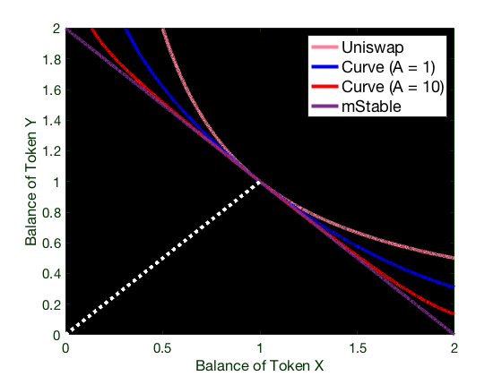

# FAQ

Answers to your questions about AMMs, tokenized bitcoin, the Saddle app, and more.

Still have questions? [Join our Discord.](https://discord.gg/hX8RZFBW9R)

## Questions

### What is Saddle?

Saddle is an automated market maker \(AMM\) for pegged value crypto assets. Saddle enables anyone holding a pegged value crypto asset to trade in between other pegged assets with minimal slippage, ensuring users don’t lose value while trading.

### What is tokenized bitcoin?

Tokenized bitcoin is BTC that has been “sent” from the Bitcoin blockchain to the Ethereum blockchain. BTC is held in a deposit contract that then “mints” a token on Ethereum that has the same value as regular BTC but can be used to the full capability of an ERC-20 token. Some examples of tokenized bitcoin include tBTC, renBTC, WBTC, and sBTC.

### What are pegged value crypto assets?

Pegged value crypto assets are tokens that have their value pegged to an underlying asset by some means. For example, the value of a stablecoin or tokenized bitcoin is supposed to be $1 or 1 BTC, respectively.

However, pegged value crypto assets fix this value using different mechanisms. Some assets, like Synthetix sBTC or sUSD, maintain their peg synthetically \(in this case, via collateralization of SNX\). Other assets maintain their peg by being backed by and redeemable for the actual underlying asset, either permissionlessly \(e.g. tBTC\) or through a centralized custodian \(e.g. WBTC, USDC\).

These different approaches and the associated risks are why the prices of pegged value crypto assets of the same type can vary slightly.

### What is price impact?

Price impact is the difference between the current market price and estimated execution price due to order size.

### What is max slippage?

Max slippage is the maximum percentage the execution price can change unfavorably by, if exceeded your transaction will revert.

Slippage occurs when other trades change the price during the window between when your transaction is submitted and actually executed.

### What is the A parameter \(amplification coefficient\)?

The A parameter, or amplification coefficient, is a configurable setting that determines how flat the liquidity curve for each pool is. For example, consider A = 1 vs. A = 10:

Pools with more volatile assets will use lower A values.

### What tokens does Saddle currently support?

<table>
  <thead>
    <tr>
      <th style="text-align:left">Token</th>
      <th style="text-align:left">Homepage</th>
    </tr>
  </thead>
  <tbody>
    <tr>
      <td style="text-align:left">tBTC</td>
      <td style="text-align:left"><a href="https://tbtc.network/">https://tbtc.network/</a>
      </td>
    </tr>
    <tr>
      <td style="text-align:left">WBTC</td>
      <td style="text-align:left"><a href="https://wbtc.network/">https://wbtc.network/</a>
      </td>
    </tr>
    <tr>
      <td style="text-align:left">renBTC</td>
      <td style="text-align:left"><a href="https://renproject.io/">https://renproject.io/</a>
      </td>
    </tr>
    <tr>
      <td style="text-align:left">sBTC</td>
      <td style="text-align:left"><a href="https://synthetix.io/">https://synthetix.io/</a>
      </td>
    </tr>
    <tr>
      <td style="text-align:left">DAI</td>
      <td style="text-align:left"><a href="https://makerdao.com/">https://makerdao.com/</a>
      </td>
    </tr>
    <tr>
      <td style="text-align:left">USDC</td>
      <td style="text-align:left"><a href="https://www.centre.io/usdc">https://www.centre.io/usdc</a>
      </td>
    </tr>
    <tr>
      <td style="text-align:left">USDT</td>
      <td style="text-align:left"><a href="https://tether.to/">https://tether.to/</a>
      </td>
    </tr>
    <tr>
      <td style="text-align:left">WETH</td>
      <td style="text-align:left"><a href="https://weth.io/">https://weth.io/</a>
      </td>
    </tr>
    <tr>
      <td style="text-align:left">vETH2</td>
      <td style="text-align:left">
        
<a href="https://www.sharedstake.org/">https://www.sharedstake.org/</a>
        

        
<a href="https://docs.sharedstake.org/contracts-explained/veth2">https://docs.sharedstake.org/contracts-explained/veth2</a>
        

      </td>
    </tr>
  </tbody>
</table>

### Why is Saddle launching with tokenized bitcoin?

Bitcoin is the largest cryptocurrency by market capitalization, and the amount of tokenized BTC on Ethereum has been exploding - the supply has increased ~135X in 2020. Despite this growth, tokenized BTC is often [not a priority](https://github.com/Uniswap/uniswap-interface/pull/1144) when it comes to features and support. We believe bitcoin deserves to be treated as a first-class citizen in DeFi.

### Will Saddle support other asset pools? When?

Yes! We will support trading between and among other pegged value crypto assets like stablecoins and ETH-based tokens. We anticipate these pools to go live in Q1 or Q2 2021.

### Does Saddle have a token?

Saddle does not currently have a token.

### What is Saddle’s guarded launch, "Proof of Governance"? Who can participate?

_The guarded launch has been successful and as of 6/22/2021 we have disabled the guard. Anyone can become a liquidity provider in Saddle's pools._

Saddle is launching with Proof of Governance to protect our users with certain limits and discourage sybil attacks. Initially, there will be a pool TVL cap of 150 BTC and a per-address deposit limit of 1 BTC. These limits will be raised every 1-2 weeks.

For LPs to qualify for PoG, an address must have demonstrated active network participation in one of the following ways:

- On-chain voting or delegation \(MKR, COMP, YFI, YAM, CRV, UNI, UMA, Moloch DAO\)
- Off-chain voting on [Snapshot](https://snapshot.page/) \(all protocols\)
- Staking SNX and minting sUSD \(&gt;$20\)

The cutoff date for all activity is October 1st, 2020, with the exception of UNI, which is January 1st, 2021.

A full list of eligible addresses is available [here](https://github.com/saddle-finance/saddle-allowlist-addresses). PoG is temporary and will be phased out in the future.

We are implementing this guarded launch to establish a more controlled environment that will allow us to ensure a stable launch and remain responsible with users’ funds in a more controlled environment. Our objective above all else is to ensure the application performs to its expectations, users’ funds remain safe, and our community of supporters, developers, and users remain confident in our ability to successfully and fairly launch.

_The guarded launch does not apply to the AMM. Users will be able to trade in between tokenized bitcoin types immediately at launch._

### Why do I get the message “Unfortunately, this address isn't eligible to deposit...” when I try to use Saddle?

Saddle is going live with a guarded launch known as Proof of Governance \(PoG\). If you see an error message, it is because the wallet you are using has not been used in one of the governance processes listed in the question above. Try connecting another wallet, or wait for the guarded launch to end.

### Who can use Saddle?

At launch, **everyone** will be able to use Saddle’s AMM to trade in between tokenized bitcoin pairs.

At launch, the only people who will be able to provide liquidity to the tokenized bitcoin pool are those who have participated in select governance processes, you can refer to the "What is Saddle’s guarded launch..." question for more details.

### How do I use Saddle?

Head to the [Saddle App](https://saddle.exchange) and start using it now!

### What are Saddle’s liquidity provider rewards?

#### tBTC pool

The Keep Network team has committed weekly reward incentives for liquidity providers. [Learn more](https://keep.network/) about the Keep network, KEEP, and your opportunities to stake KEEP for additional APY.

You can access Keep Network's [staking dashboard](https://dashboard.keep.network/liquidity) to stake your LP tokens.

#### vETH2 pool

The SharedStake team has an ongoing reward program for those who are providing liquidity in Saddle.

You can access the SharedStake's [staking dashboard](https://www.sharedstake.org/earn) to stake your vETH2 pool LP tokens.

#### alETH pool

The Alchemix team has an ongoing reward program for those who are providing liquidity in Saddle.

You can access Alchemix's [staking dashboard](https://app.alchemix.fi/farms) to stake your alETH pool LP tokens.

### What is tBTC?

tBTC is the first truly decentralized, secure tokenized bitcoin solution. tBTC is secured by the Keep network, a blockchain solution to privacy. The Keep network stores the keys of minted tBTC in decentralized “keeps”, thus eliminating centralized weak points.

### What are the fees for using Saddle?

There is no fee to withdraw your liquidity from Saddle pools. Initial versions of our contracts contained a withdrawal fee feature, but we have decided to remove this from all future pools.

### Who built Saddle?

Saddle is built by DeFi natives with prior years of developer experience at Web2 companies like Uber, Amazon, and Square. You might have interacted with our founder [Sunil](https://www.linkedin.com/in/sunilsrivatsa/) \(aka [devops199fan](https://twitter.com/devops199fan)\) in the YFI community \(he’s a multisig signer\), or used tools created by members of our team, like [yieldfarming.info](https://yieldfarming.info/) by [John](https://www.linkedin.com/in/jongseunglim/) \(aka [Weeb_Mcgee](https://twitter.com/Weeb_Mcgee)\).

### Is Saddle safe?

Saddle has been audited by Certik, Quantstamp, and OpenZeppelin. Read the audits [here](https://github.com/saddle-finance/saddle-audits).

### Who controls Saddle's admin keys?

Saddle's admin keys are controlled by a [3/5 Gnosis Safe multisig](https://etherscan.io/address/0x3F8E527aF4e0c6e763e8f368AC679c44C45626aE). The signers are Mariano Conti, Kain Warwick, DegenSpartan, Klim K, and Damir Bandalo. This multisig has capabilities to pause new deposits and trades in case of technical emergencies. Users will always be able to withdraw their funds regardless of new deposits being paused. The multisig can also change the swap/withdrawal fees and the per pool/account deposit limits.

| Name                                              | ENS               | Address                                    |
| :------------------------------------------------ | :---------------- | :----------------------------------------- |
| [Mariano Conti](https://twitter.com/nanexcool)    |                   | 0x6F2A8Ee9452ba7d336b3fba03caC27f7818AeAD6 |
| [Kain Warwick](https://twitter.com/kaiynne)       | Kain.eth          | 0x5b97680e165b4dbf5c45f4ff4241e85f418c66c2 |
| [DegenSpartan](https://twitter.com/DegenSpartan)  | degenspartan.eth  | 0x4E60bE84870FE6AE350B563A121042396Abe1eaF |
| [Klim K](https://twitter.com/milkyklim)           | yfi.milkyklim.eth | 0x0cec743b8ce4ef8802cac0e5df18a180ed8402a7 |
| [Damir Bandalo](https://twitter.com/damirbandalo) |                   | 0xa83838221278f22ee5bAe3E523f34D42b066D67D |

### How can I keep up with Saddle?

[Discord](https://discord.gg/hX8RZFBW9R)! [Twitter](https://twitter.com/saddlefinance)! [Telegram](https://t.me/saddle_finance)! [Github](https://github.com/saddle-finance)! [Medium](https://medium.com/saddle)!

### Are there alternate frontends to interact with the Saddle protocol?

There are several frontends available:

- [Main dApp](https://saddle.exchange/)
- [ENS](https://saddlefinance.eth.link/)
- [Fleek Mirror](https://saddlefinance.on.fleek.co/)
- [IPNS](https://ipfs.io/ipns/saddle.exchange)

You can also use any of the following aggregators:

- [1inch](https://app.1inch.io/)
- [Matcha](https://matcha.xyz/)
- [Paraswap](https://paraswap.io/)

You can also run the frontend locally, check out the [saddle-frontend repo](https://github.com/saddle-finance/saddle-frontend) for more details.
